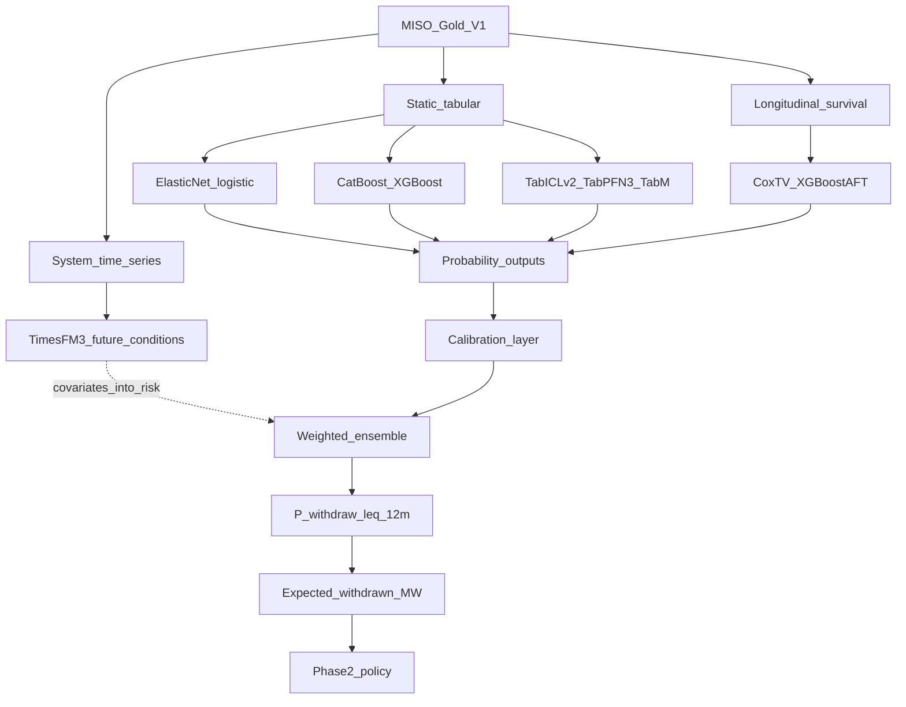

# Phase 1 model architecture

Canonical design for predicting interconnection **withdrawal within 12 months**, then feeding Phase 2.

This repository currently ships the **point-in-time feature store** and model-ready matrices. Fitting the leaves below is a later experiment pass; the architecture and data routing are fixed here.

## Canonical architecture

```text
                         MISO GOLD V1
                              │
              ┌───────────────┼────────────────┐
              │               │                │
        STATIC TABULAR    LONGITUDINAL      SYSTEM TIME SERIES
              │               │                │
       ┌──────┼───────┐       │            TimesFM-3
       │      │       │       │                │
   Logistic  Trees   TFMs     Survival      Future system
       │      │       │       │             conditions
       │   CatBoost  TabICL   Cox-TV           │
       │   XGBoost   TabPFN3  XGB-AFT          │
       │      │      TabM     │                │
       └──────┴───────┴───────┴────────────────┘
                       │
                probability outputs
                       │
                 calibration layer
                       │
                weighted ensemble
                       │
                       ▼
              P(withdrawal ≤ 12m)
                       │
                       ▼
             expected withdrawn MW
                       │
                       ▼
                 PHASE 2 POLICY
```



### Why three Gold-derived branches

| Branch | Input | Role |
|--------|-------|------|
| **Static tabular** | Annual / enriched panel → model matrices | Project-row \(P(W_{12m})\) classification |
| **Longitudinal** | `data/gold/survival_training/` | Time-to-withdrawal / dynamic hazard |
| **System time series** | Monthly macros / queue aggregates | Forecast future system conditions (TimesFM-3) |

TimesFM-3 is **not** a substitute for TabICL on project rows. It forecasts contiguous multivariate series (demand, withdrawn MW, rates, …) that can enter risk models and Phase 2 as forward-looking covariates.

### Why not a wide/deep MLP

Train scale is roughly **3,277** rows × **85** V1 features (~39 rows/feature). With ~12% prevalence there are only ~**400** positive withdrawals. A wide net (e.g. \(85 \rightarrow 512 \rightarrow 256 \rightarrow 1\)) easily exceeds \(10^5\) weights — overfitting risk dominates. Prefer TabM (parameter-efficient ensemble) if a neural challenger is needed.

## Static branch: five matrix views

Same semantic information; different encodings for different model families.

| View | Path pattern | Encoding | Use |
|------|--------------|----------|-----|
| Logistic | `logistic_v1_*` | Median impute + StandardScaler + one-hot | Elastic-Net / L2 logistic |
| XGBoost | `tree_v1_*` | NaNs kept + one-hot | XGBoost |
| CatBoost | `catboost_native_v1_*` | Native categoricals; numeric NaNs; no scale | CatBoost |
| Foundation | `foundation_v1_*` | Native categoricals; NaNs; **no** scale / one-hot | TabICLv2, TabPFN-3 |
| TabM | `tabm_v1_*` | Int category IDs + train-median + StandardScaler on numerics | TabM |

**Do not** feed `logistic_v1` (or any scaled one-hot matrix) to TabICL / TabPFN / CatBoost-native. Those models own categorical handling (and TFMs own imputation/normalization).

Build / refresh matrices:

```bash
python scripts/prepare_model_matrices.py
```

See [`data/gold/modeling/README.md`](../data/gold/modeling/README.md). Experiment protocol: [`modeling_experiment_protocol.md`](modeling_experiment_protocol.md).

## Model leaves (priority order)

| Priority | Model | Branch | Why |
|----------|-------|--------|-----|
| 1 | Elastic-Net logistic | Static / logistic | Sanity + interpretability |
| 2 | CatBoost | Static / trees | Strong tabular baseline |
| 3 | XGBoost | Static / trees | Nonlinear benchmark |
| 4 | **TabICLv2** | Static / foundation | Best open TFM task fit (pretrained ~300–48k rows, 2–100 cols; we are ~3277×85) |
| 5 | TabPFN-3 | Static / foundation | Frontier research challenger |
| 6 | TabM | Static / foundation | Neural-style experiment without a giant MLP |
| 7 | Cox TV / XGBoost AFT | Longitudinal | Dynamic time-to-event risk |
| 8 | TimesFM-3 | System series | Future system conditions for risk / Phase 2 |

Head-to-head of particular interest on the **fixed temporal validation** set:

**CatBoost vs TabICLv2 vs TabPFN-3**.

### Licensing

| Model | Research / Xtern | Future MISO production |
|-------|------------------|------------------------|
| TabICLv2 (`pip install tabicl`) | Open / permissive | Attractive open candidate |
| TabPFN-3 | Excellent research challenger | Requires separate commercial license review |
| CatBoost / XGBoost / logistic | Fine | Fine |

## Evaluation and selection (not PR-AUC alone)

Phase 2 needs **probability quality**, not only ranking.

| Metric | Role |
|--------|------|
| PR-AUC | Primary ranking under class imbalance |
| ROC-AUC | Secondary discrimination |
| Brier score | Probability accuracy |
| Calibration (curve / ECE) | Reliability of \(p\) as scenario weights |

Protocol helpers: [`src/modeling/eval_protocol.py`](../src/modeling/eval_protocol.py).

Rules:

1. Fit / ICL context only on **train** (and `complete_followup` where labels are used).
2. Choose hyperparameters / ensemble weights on **val** (2023).
3. Report once on **test** (2024); do not tune on test.
4. Score split (2025+) has incomplete follow-up — do not treat label rates as supervised truth.

### Calibration → weighted ensemble

After per-model calibration:

\[
p_{\mathrm{final}} = \sum_i w_i\, p_i,\qquad w_i \ge 0,\quad \sum_i w_i = 1
\]

Choose \(w_i\) on validation using Brier / calibration-aware criteria (not PR-AUC alone). Then:

\[
\mathbb{E}[\mathrm{withdrawn\ MW}] = \sum_i p_i \cdot \mathrm{capacity\_mw}_i
\]

(or policy-relevant capacity field) as the Phase 2 shock size input.

### AutoGluon (ceiling only)

AutoGluon 1.6+ can be a **performance ceiling** (presets that include TabICLv2 / TabPFN). It is **not** the scientific model of record. Always force the repository temporal train/val split — never random CV that breaks PIT.

## PIT split (non-negotiable)

From [`data/gold/split_manifest.json`](../data/gold/split_manifest.json):

| Split | Years |
|-------|-------|
| train | 2020–2022 |
| val | 2023 |
| test | 2024 |
| score | 2025+ current MISO |

## Phase B (in progress — core leaves live)

Defaults + tournament runners:

```bash
python scripts/run_baseline_leaderboard.py
python scripts/run_calibration.py          # Platt/isotonic on champion val probs
python scripts/run_survival_tournament.py  # Cox-TV + discrete/boost/RSF
python scripts/run_timesfm_experiment.py   # TimesFM-3 system monthly/annual series
python scripts/run_timesfm_catboost_wiring.py  # TimesFM/MA3 → CatBoost covariates
```

**Live now:** CatBoost/LGBM/XGB (+ tuned), calibration layer (`artifacts/calibration/`), Cox-TV + discrete survival, TimesFM-3 on CUDA, TimesFM→CatBoost wiring experiment (`artifacts/metrics/timesfm_catboost_wiring.md` — **no promotion**; ΔPR-AUC ≪ 0.01). **Still thin:** ensemble weights, XGB-AFT API, CoxPH convergence on this panel.
## Related docs

- Project goal (Phase 1→2): [`project_goal.md`](project_goal.md)
- Pipeline / rebuild: [`pipeline.md`](pipeline.md)
- Code map: [`code_map.md`](code_map.md)
- Feature policy V1: [`../data/quality_reports/modeling/feature_policy_v1.md`](../data/quality_reports/modeling/feature_policy_v1.md)
