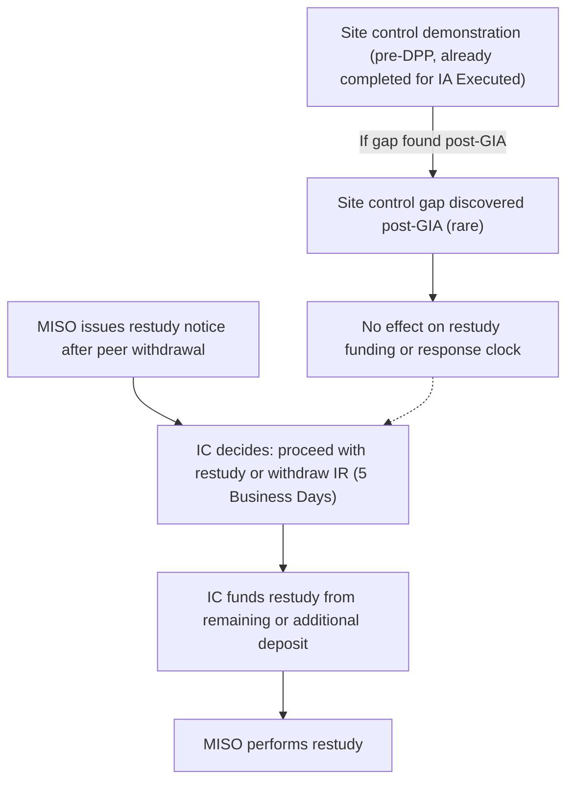

# Turn 1 (t1_card_plus_restudy)

Question:

I am looking at the Platinum 3 risk card for this IR: IA Executed, planned COD already passed, delayed-MW pile crowded, and developer serial quit is flagged. A peer in the same DPP cycle has withdrawn, so I need two tracks in one note, not a slogan. First, read the card as risk context only: what those flags do and do not authorize you to claim. Second, walk the BPM-015 r33 restudy path if MISO restudies because that peer left before all GIAs/FCAs/MPFCAs for the cycle were executed or filed unexecuted: who notices, who funds the restudy from remaining deposit or additional deposit, and the Interconnection Customer deadline. Do not treat p(quit) or pile crowding as a BPM duty. Do not invent a serial-quit clause.

searched=True shape=long

# Interconnection procedure note

## 1. Risk Card Context: What the Flags Do and Do Not Authorize

The Platinum 3 risk card for this interconnection request (IR) shows the following as-of facts: the Generator Interconnection Agreement (GIA) is executed, the planned Commercial Operation Date (COD) has already passed, the delayed-MW pile is crowded, and the developer serial quit flag is present. CatBoost P(quit 12m) is 0.07, which is a ranking score for relative quit risk, not a BPM-015 r33 trigger or a withdrawal verdict. Platinum 2 delayed MW (25,299.4 MW as of the observation date) reflects system-wide EIA-reported delays, not this IR’s COD or a direct cause for restudy.

These flags and risk scores are for context only. They do not create or modify any BPM-015 r33 procedural duties. Specifically:

- CatBoost P(quit 12m) is a statistical risk ranking and does not authorize or require any BPM-015 r33 action.
- The delayed-MW pile is a system-level indicator and does not substitute for MISO’s study or restudy triggers.
- The developer serial quit flag is a stub risk; there is no BPM-015 r33 clause that creates a procedural step based on this flag.
- Do not claim that months of future COD slip, system crowding, or scenario deltas are BPM-015 r33 triggers or compliance outcomes.
- Only retrieved BPM-015 r33 units may be cited as procedure. Stubs and overlays are for context, not for workflow.

## 2. BPM-015 r33 Restudy Path After Peer Withdrawal

If MISO determines that a restudy of an Interconnection Study is required because a peer interconnection request withdraws or is deemed withdrawn before all GIAs, Facilities Construction Agreements (FCAs), and/or Multi-Party Facilities Construction Agreements (MPFCAs) for the DPP cycle have been executed or filed unexecuted with FERC, the following process applies:

- MISO shall provide notice of the restudy as necessary. The notice will include a preliminary analysis supporting the need for restudy, an explanation of why restudy is required, and a good faith estimate of the cost to perform the restudy (BPM-015 r33 §5.4.6).
- The Interconnection Customer (IC) shall notify MISO within five (5) Business Days whether it wishes to proceed with the restudy or withdraw its IR. If the IC does not respond within this deadline, MISO will deem the IR withdrawn (BPM-015 r33 §5.4.6).
- The IC funds the restudy from any remaining study deposit or from an additional deposit as noticed by MISO (BPM-015 r33 §5.4.6).
- MISO will use reasonable efforts to complete the restudy within sixty (60) Calendar Days from the date of notice (BPM-015 r33 §5.4.6).
- The Transmission Owner (TO) coordinates on affected facilities as needed.

## Citations
- BPM-015 r33 §5.4.6 - Interconnection Study Restudy (pages 56-56)

## Gaps
- developer_serial_quit has no BPM-015 clause
- hazard_exposure has no BPM-015 clause

## Must Not Claim

- Do not quote months of future COD slip as a model output.
- Do not claim a MISO Step-Up / Firm Service failure record.
- Do not treat scenario deltas or system crowding as causal effects or BPM triggers.
- Do not treat the developer serial quit flag as a BPM-015 r33 procedural step.

## Must not claim
- do not quote months of future COD slip as a model output
- do not claim a MISO Step-Up / Firm Service failure record
- do not treat EIA delayed MW as a complete GIA list (overlay is thin)
- do not treat scenario deltas as causal effects
- do not use FERC-730 as a clean delay source
- do not unseal 2024 test labels or tune on test/score

Compliance: not_determined.

---

# Turn 2 (t2_inline_clock)

Question:

Stay on that last restudy track. I still need the IC response clock and who actually puts up the money, in enough detail to sit beside the card's restudy_friction flag. How many Business Days does the IC have after the notice, what happens if they stay silent, and does the serial-quit flag change any of that funding or timing. Quote only what you already held unless a clause is missing.

searched=False shape=long

# Interconnection procedure note

## Restudy Response Clock and Funding: BPM-015 r33 Procedure

If MISO determines that a restudy of an Interconnection Study is required because an interconnection request (IR) withdraws or is deemed withdrawn before all Generator Interconnection Agreements (GIAs), Facilities Construction Agreements (FCAs), and/or Multi-Party Facilities Construction Agreements (MPFCAs) for the DPP cycle have been executed or filed unexecuted with FERC, MISO shall provide notice of the restudy as necessary (BPM-015 r33 §5.4.6). The notice will include a preliminary analysis, an explanation of why restudy is required, and a good faith estimate of the cost.

The Interconnection Customer (IC) shall notify MISO within five (5) Business Days whether it wishes to proceed with the restudy or withdraw its IR. If the IC does not respond within this five (5) Business Day window, MISO will deem the IR withdrawn (BPM-015 r33 §5.4.6).

The IC funds the restudy from any remaining study deposit or, if necessary, by providing an additional deposit as noticed by MISO. If the IC has replaced the cash study deposit with a Letter of Credit, MISO will notify the IC and provide the option to submit the cash equivalent within thirty (30) Calendar Days. If the IC fails to respond within the requested timeframe, MISO may draw upon the Letter of Credit to cover restudy expenses (BPM-015 r33 §4.2.4).

The developer serial quit flag on the risk card does not alter the BPM-015 r33 restudy response clock or funding requirements. The presence of this flag is a risk context indicator only and does not create or modify any procedural duty or timeline under BPM-015 r33.

## Citations
- BPM-015 r33 §5.4.6 - Interconnection Study Restudy (pages 56-56)
- BPM-015 r33 §4.2.4 - Study Deposits and Refunds (pages 30-30)

## Gaps
developer_serial_quit has no BPM-015 clause

## Must not claim
- do not quote months of future COD slip as a model output
- do not claim a MISO Step-Up / Firm Service failure record
- do not treat EIA delayed MW as a complete GIA list (overlay is thin)
- do not treat scenario deltas as causal effects
- do not use FERC-730 as a clean delay source
- do not unseal 2024 test labels or tune on test/score

Compliance: not_determined.

---

# Turn 3 (t3_d2_vs_restudy)

Question:

Combine two deposit analyses for this same IR. Track A is the restudy funding you already described. Track B is the DPP Study Funding Deposit D2 if the IC withdraws instead of proceeding. I need both in one note: when D2 is refunded less actual study cost versus at risk, and whether a restudy notice after a peer withdrawal uses D2, a remaining study deposit, or a separate additional deposit as noticed. Do not collapse D2 into a parent refund section if §4.2.4.5 is in the packet. Then tell me whether those two tracks can both be true at once for an IA-executed project.

searched=True shape=long

# Interconnection procedure note

## Track A: Restudy Funding After Peer Withdrawal

If MISO determines that a restudy of an Interconnection Study is required because an interconnection request (IR) withdraws or is deemed withdrawn before all Generator Interconnection Agreements (GIAs), Facilities Construction Agreements (FCAs), and/or Multi-Party Facilities Construction Agreements (MPFCAs) for the DPP cycle have been executed or filed unexecuted with FERC, MISO shall provide notice of a restudy as necessary (BPM-015 r33 §5.4.6). The notice will include a preliminary analysis, an explanation of why restudy is required, and a good faith estimate of the cost to perform the restudy. The Interconnection Customer (IC) shall notify MISO within five (5) Business Days whether it wishes to proceed with the restudy or withdraw the IR. If the IC does not respond, MISO will deem the IR withdrawn. The IC funds the restudy from any remaining study deposit or from an additional deposit as noticed by MISO (BPM-015 r33 §5.4.6). The serial-quit flag on the risk card does not alter this funding or timing.

## Track B: DPP Study Funding Deposit (D2) Refund or At-Risk Status

The DPP Study Funding Deposit (D2) is required for entry into the Definitive Planning Phase (DPP). The amount is based on project size, as shown in Table 4-1 of BPM-015 r33 §4.2.4.5. If the IC withdraws prior to entry into DPP Phase I, the D2 deposit is refunded one hundred percent (100%) (BPM-015 r33 §4.2.4.6). If the IC withdraws by the end of IC Decision Point I, the D2 deposit is refunded less the actual cost of the applicable Interconnection Study performed during DPP Phase I. If the IC withdraws after Decision Point I, the D2 deposit becomes one hundred percent (100%) at risk and is used to fund study costs and Network Upgrades (BPM-015 r33 §4.2.4.6). For an IR that has already executed a GIA, the D2 deposit would have been fully at risk and likely already applied to study costs.

## Can Both Tracks Be True at Once for an IA-Executed Project?

For a project with an executed Interconnection Agreement (IA or GIA), the D2 deposit is already at risk and would have been used to fund study costs as the project advanced through the DPP phases. If a restudy is triggered after GIA execution due to a peer withdrawal, the restudy is funded from any remaining study deposit or from an additional deposit as noticed by MISO, not from the D2 deposit (BPM-015 r33 §5.4.6). Therefore, both tracks cannot be simultaneously active for the same IR at the IA-executed stage: the D2 refund/at-risk process is complete, and any new restudy funding obligation is a separate process based on remaining or additional deposits as noticed.

## Citations
- BPM-015 r33 §4.2.4.5 - DPP Study Funding Deposit (D2) (pages 33-34)
- BPM-015 r33 §5.4.6 - Interconnection Study Restudy (pages 56-56)
- BPM-015 r33 §4.2.4.6 - Refunds of Study Deposits (pages 34-35)

## Gaps
- developer_serial_quit has no BPM-015 clause
- The GIP (Attachment X) is the tariff and is not in this packet.

## Must not claim
- do not quote months of future COD slip as a model output
- do not claim a MISO Step-Up / Firm Service failure record
- do not treat EIA delayed MW as a complete GIA list (overlay is thin)
- do not treat scenario deltas as causal effects
- do not use FERC-730 as a clean delay source
- do not unseal 2024 test labels or tune on test/score

Compliance: not_determined.

---

# Turn 4 (t4_site_control_overlay)

Question:

Keep the restudy and D2 tracks in history. Now overlay a third analysis: site control for this same IR. The card is already IA Executed, so site control may be a prior-phase duty. I need you to compare (1) the site-control demonstration and timing in BPM-015 r33 with (2) the restudy notice path from the last notes, and say whether missing site control rewrites the restudy funding or the five-Business-Day clock. Include a procedure map of who acts if a peer withdrawal restudy notice and a site-control gap are both on the desk. If FEMA hazard or IRA energy-community on a sister card would change either track, say so or put the hole under Gaps.

searched=True shape=diagram

# Interconnection procedure note

## 1. Site Control Demonstration and Timing

The Interconnection Customer (IC) must demonstrate site control by submitting a Geographic Information System (GIS) site plan map, data files, and documentation showing sufficient land, parcel boundaries, and the proposed locations of key facilities. This demonstration is required at least ninety (90) Calendar Days prior to the scheduled kick-off of Definitive Planning Phase (DPP) Phase I, as published by MISO (BPM-015 r33 §5.1.2). The site control requirement is a pre-DPP entry obligation and is not a recurring duty in the Generator Interconnection Agreement (GIA) or post-GIA phase.

## 2. Restudy Notice Path After Peer Withdrawal

If MISO determines that a restudy of an Interconnection Study is required because an interconnection request (IR) withdraws or is deemed withdrawn before all Generator Interconnection Agreements (GIAs), Facilities Construction Agreements (FCAs), and/or Multi-Party Facilities Construction Agreements (MPFCAs) for the DPP cycle have been executed or filed unexecuted with FERC, MISO shall provide notice of restudy as necessary. The notice includes a preliminary analysis, an explanation of why restudy is required, and a good faith estimate of cost. The IC shall notify MISO within five (5) Business Days whether it wishes to proceed with the restudy or withdraw the IR. Failure to notify MISO is deemed withdrawal. The IC funds the restudy from the remaining study deposit or from an additional deposit as noticed (BPM-015 r33 §5.4.6).

## 3. DPP Study Funding Deposit (D2) Track

The DPP Study Funding Deposit (D2) is required prior to entry into the DPP. The IC must pay the D2 deposit based on project size. Failure to pay the D2 deposit results in withdrawal of the IR (BPM-015 r33 §4.2.4.5). D2 is not used to fund restudy after GIA execution; restudy is funded from the remaining study deposit or additional deposit as noticed.

## 4. Interaction: Does Missing Site Control Affect Restudy Funding or the Five-Business-Day Clock?

Missing site control is a pre-DPP entry deficiency. For an IR that has already executed a GIA, the site control demonstration is a completed, prior-phase duty. There is no BPM-015 r33 clause that rewrites the restudy funding source or the five-Business-Day response clock based on a site control gap at this late phase. If a site control deficiency were discovered post-GIA, it would not alter the restudy notice, funding, or response timing as described in BPM-015 r33 §5.4.6. The restudy process and deadlines remain as stated above.

## 5. Overlay: Peer Withdrawal Restudy Notice and Site Control Gap

If both a peer withdrawal restudy notice and a site control gap are present, the IC must respond to the restudy notice within five (5) Business Days and fund the restudy as noticed. The site control gap, if discovered post-GIA, does not pause or modify the restudy process under BPM-015 r33.

## 6. FEMA Hazard or IRA Energy-Community Status

There is no BPM-015 r33 clause retrieved that modifies the site control, restudy, or D2 deposit tracks based on FEMA hazard or IRA energy-community status for this IR or a sister card.

---

## Procedure map

This diagram shows that the restudy process after a peer withdrawal is independent of the site control demonstration, which is a pre-DPP entry requirement. If a site control gap is discovered after GIA execution, it does not affect the restudy funding or the five-Business-Day response clock. The IC must still respond to the restudy notice and fund the restudy as required.

---

## Citations
- BPM-015 r33 §5.1.2 - Site Control Requirements Review Detail (pages 42-47)
- BPM-015 r33 §5.4.6 - Interconnection Study Restudy (pages 56-56)
- BPM-015 r33 §4.2.4.5 - DPP Study Funding Deposit (D2) (pages 33-34)

## Gaps
- hazard_exposure has no BPM-015 clause
- developer_serial_quit has no BPM-015 clause
- policy_incentive has no BPM-015 clause

## Must not claim
- do not quote months of future COD slip as a model output
- do not claim a MISO Step-Up / Firm Service failure record
- do not treat EIA delayed MW as a complete GIA list (overlay is thin)
- do not treat scenario deltas as causal effects
- do not use FERC-730 as a clean delay source
- do not unseal 2024 test labels or tune on test/score

Compliance: not_determined.

---

# Turn 5 (t5_gip_cod_card)

Question:

From the last notes, combine tariff posture with post-GIA delay for this same executed GIA. The card says COD has already passed. If the IC misses the restudy-notice window, BPM-015 r33 treats that as deemed withdrawal of the IR and points at Section 3.6 of the GIP. I need both analyses without merging them into one fake rule: (1) what the held restudy unit actually says versus what Attachment X would have to supply, and (2) whether §7.3 still governs IC delay / milestone amendment on this executed GIA because COD has slipped. Do not infer that the GIA is void. Do not quote months of future COD slip. If the GIP is not in the packet, keep it in Gaps and still restudy versus §7.3 as two tracks.

searched=False shape=long

# Interconnection procedure note

## 1. Restudy Notice and Tariff Posture (BPM-015 r33 §5.4.6)

If MISO determines that a restudy of an Interconnection Study is required because an interconnection request (IR) withdraws or is deemed withdrawn before all Generator Interconnection Agreements (GIAs), Facilities Construction Agreements (FCAs), and/or Multi-Party Facilities Construction Agreements (MPFCAs) for the DPP cycle have been executed or filed unexecuted with FERC, MISO shall provide notice of a restudy as necessary. The notice must include a preliminary analysis, an explanation of why restudy is required, and a good faith estimate of the cost to perform the restudy. The Interconnection Customer (IC) shall notify MISO within five (5) Business Days whether it wishes to proceed with the restudy or withdraw the IR. If the IC fails to respond within this window, MISO will deem the IR withdrawn (BPM-015 r33 §5.4.6).

BPM-015 r33 §5.4.6 states that the restudy will be performed according to the Generator Interconnection Procedures (GIP) and the BPMs in effect at the time of notice. However, the GIP (Attachment X) is not included in this packet, so any further process or effect of deemed withdrawal under Section 3.6 of the GIP cannot be detailed here. The BPM does not state that a missed restudy-notice window voids an already-executed GIA; it only addresses the IR. The funding for the restudy comes from the remaining study deposit or from an additional deposit as noticed by MISO.

## 2. Post-GIA Delay and Milestone Amendment (BPM-015 r33 §7.3)

If the Commercial Operation Date (COD) has already passed and the IC seeks to amend GIA milestones due to delay, BPM-015 r33 §7.3 governs the process. The IC must provide a written statement from a company officer or authorized agent describing the circumstances requiring the milestone change. The IC and the Transmission Owner (TO) must agree on specific milestone changes in writing and in advance of submitting the request to MISO. MISO and the TO must both consent to any amendment of GIA milestones, as required by Article 30.10 of the pro forma GIA. The IC must also demonstrate that the proposed change does not present significant potential for harm to other queued projects. BPM-015 r33 §7.3 remains applicable to the executed GIA and governs requests for milestone amendments due to IC delay, regardless of any restudy notice or IR withdrawal process (BPM-015 r33 §7.3).

## Gaps
The GIP (Attachment X) is the tariff and is not in this packet.

## Must Not Claim

- Do not infer that missing the restudy-notice window voids the executed GIA.
- Do not quote months of future COD slip as a model output.
- Do not treat Platinum 3 flags or CatBoost P(quit) as BPM duties.

## Citations
- BPM-015 r33 §5.4.6 - Interconnection Study Restudy (pages 56-56)
- BPM-015 r33 §7.3 - Interconnection Customer delays (pages 128-129)

## Must not claim
- do not quote months of future COD slip as a model output
- do not claim a MISO Step-Up / Firm Service failure record
- do not treat EIA delayed MW as a complete GIA list (overlay is thin)
- do not treat scenario deltas as causal effects
- do not use FERC-730 as a clean delay source
- do not unseal 2024 test labels or tune on test/score

Compliance: not_determined.
